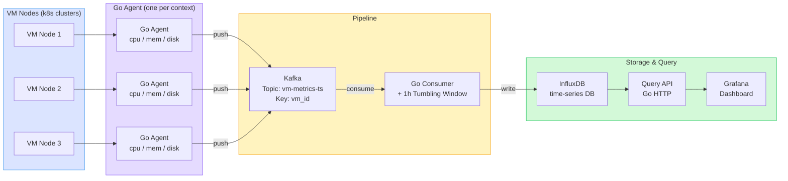

# vm-metrics-collector — Design Document (World 1)

## Overview

A distributed VM metrics monitoring pipeline built in Go. Addresses three gaps from a system design interview:

- Time-series databases (InfluxDB) vs SQL
- Kafka windowed aggregation (1-hour tumbling windows)
- Push vs pull metrics model

The agent reads node metrics from Kubernetes clusters via kubeconfig and pushes them through Kafka into InfluxDB. A REST API and Grafana dashboard expose the data.

---

## Architecture



### World 1 — docker-compose network layout

```
[MacBook]
  └── docker-compose network
        ├── kafka:9092
        ├── influxdb:8086
        ├── agent  ──────────────────────→  kubeconfig → k8s clusters
        ├── consumer
        ├── api:8080
        └── grafana:3000
```

The **agent is the only container that reaches outside** — it mounts `~/.kube/config` read-only and calls the Kubernetes Metrics API on remote clusters or Rancher Desktop.

---

## Component Breakdown

| Component      | Tech                          | Role                                                              |
|----------------|-------------------------------|-------------------------------------------------------------------|
| Metrics Agent  | Go                            | Reads node metrics via kubeconfig → pushes to Kafka every 15s    |
| Kafka          | confluentinc/cp-kafka (KRaft) | Durable message queue, partitioned by `vm_id`                     |
| Consumer       | Go                            | Reads Kafka → writes InfluxDB, handles 1h tumbling window         |
| InfluxDB       | influxdb:2.7                  | Time-series storage optimized for metrics + timestamps            |
| Query API      | Go (`net/http` + `chi`)       | REST endpoints to query metrics by VM and time range              |
| Grafana        | grafana/grafana:10.4.0        | Dashboard auto-provisioned against InfluxDB                       |

---

## File Structure

```
vm-metrics-collector/
├── docker-compose.yml
├── cmd/
│   ├── agent/
│   │   ├── main.go          ← scrapes k8s metrics API, produces to Kafka
│   │   └── Dockerfile
│   ├── consumer/
│   │   ├── main.go          ← consumes Kafka, writes InfluxDB, windowing
│   │   └── Dockerfile
│   └── api/
│       ├── main.go          ← REST query layer over InfluxDB
│       └── Dockerfile
├── internal/
│   ├── metrics/             ← k8s Metrics API client (metrics.k8s.io/v1beta1)
│   │                           used by: cmd/agent
│   ├── kafka/               ← producer helper + consumer helper
│   │                           used by: cmd/agent (producer), cmd/consumer (consumer)
│   └── influx/              ← InfluxDB write client + query client
│                               used by: cmd/consumer (write), cmd/api (query)
├── grafana/
│   └── provisioning/
│       └── datasources/
│           └── influxdb.yaml   ← auto-wires Grafana → InfluxDB on startup
├── DOCS/
│   └── design.md
├── go.mod
├── go.sum
└── README.md
```

---

## Data Flow & Workflow

### Step-by-step

```
1. Agent starts
   └── Reads KUBE_CONTEXTS env var (e.g. "rancher-desktop")
   └── Every SCRAPE_INTERVAL_SECONDS (default: 15s):
         GET /apis/metrics.k8s.io/v1beta1/nodes
         → extracts cpu_percent, mem_percent per node
         → tags with vm_id, hostname, region, timestamp
         → produces JSON message to Kafka topic vm-metrics-ts
              key = vm_id  ← ensures same VM → same partition

2. Kafka buffers messages
   └── Topic: vm-metrics-ts
   └── Partitions: N (match consumer count)
   └── Retention: 7 days

3. Consumer reads from Kafka
   └── Belongs to consumer group: vm-metrics-consumer-group
   └── Writes raw metric immediately to InfluxDB (real-time queries)
   └── Accumulates into 1-hour tumbling window per vm_id
         On window boundary (each full hour):
           → flush avg/min/max/p95 of cpu/mem/disk to InfluxDB
           → commit Kafka offset

4. InfluxDB stores measurements
   └── Measurement: vm_metrics
   └── Tags: vm_id, hostname, region
   └── Fields: cpu_percent, mem_percent, disk_percent,
               net_in_bytes, net_out_bytes
   └── Timestamp: nanosecond precision

5. Query API serves requests
   └── Reads from InfluxDB via Flux queries
   └── Exposes REST endpoints (see API section)

6. Grafana visualizes
   └── Auto-provisioned datasource pointing to InfluxDB
   └── Dashboards show per-VM time-series and 1h summaries
```

---

## Kafka Topic Design

```
Topic:      vm-metrics-ts
Partitions: N  (match to consumer replica count)
Key:        vm_id   ← all metrics for one VM go to the same partition
Retention:  7 days
```

**Why partition by `vm_id`:** Guarantees ordered delivery per VM, enabling correct in-order tumbling window computation on the consumer side.

---

## 1-Hour Tumbling Window

```
Timeline for vm_id = "node-1":

│── 00:00 ──────────────────── 01:00 ──── boundary ──── 02:00 ──│
│   raw metrics every 15s      │  flush avg/min/max/p95          │
│   accumulated in memory      │  written to InfluxDB            │
│                               │  Kafka offset committed        │
```

- **Window type:** Tumbling (non-overlapping, fixed 1-hour buckets)
- **State:** Kept in-process per partition (no external state store needed at this scale)
- **Late data:** Configurable grace period; late messages update the window before flush

---

## InfluxDB Schema

```
Measurement: vm_metrics
Tags:        vm_id, hostname, region
Fields:      cpu_percent (float), mem_percent (float), disk_percent (float),
             net_in_bytes (int), net_out_bytes (int)
Timestamp:   nanosecond precision
```

**Why InfluxDB over SQL:**

| Concern          | SQL (PostgreSQL)         | Time-Series (InfluxDB)          |
|------------------|--------------------------|---------------------------------|
| Query pattern    | Flexible joins           | Time-range + tag filters        |
| Write throughput | Moderate                 | Very high (append-optimized)    |
| Compression      | Standard                 | High (delta encoding for time)  |
| Retention        | Manual                   | Built-in policies               |
| Best for         | Relational data          | Metrics, events, logs           |

---

## REST API

```
GET /metrics/{vm_id}?start=<unix>&end=<unix>&resolution=1m
    → raw metrics for a VM in a time range

GET /metrics/{vm_id}/summary?window=1h
    → pre-aggregated avg/min/max/p95 for the given window

GET /vms
    → list all known VM IDs seen in InfluxDB

GET /health
    → liveness check
```

---

## Push vs Pull Model

| Aspect       | Push (this project)             | Pull (Prometheus model)          |
|--------------|---------------------------------|----------------------------------|
| Agent        | Pushes to Kafka                 | Exposes `/metrics` endpoint      |
| Collector    | Kafka consumer                  | Prometheus scrapes endpoint      |
| Good for     | Many short-lived VMs            | Stable, long-running services    |
| Backpressure | Kafka handles it                | Scrape interval controls it      |

**Why push here:** VM nodes may come and go; Kafka provides durable buffering so no metrics are lost if the consumer is temporarily down.

---

## Scalability (docker-compose)

| Component  | Stateful? | `--scale` works? | Reason                                      |
|------------|-----------|------------------|---------------------------------------------|
| `agent`    | No        | Yes              | No disk state, no port conflict             |
| `consumer` | No        | Yes              | Kafka consumer group rebalances partitions  |
| `api`      | No        | Yes              | Needs a load balancer (nginx/Traefik)       |
| `kafka`    | Yes       | No               | Brokers need cluster protocol coordination  |
| `influxdb` | Yes       | No               | Data would split across instances           |
| `grafana`  | Yes       | No               | Session state + volume conflicts            |

Scale stateless components with a single flag:

```bash
docker-compose up --scale consumer=3 --scale agent=5
```

Kafka's consumer group protocol auto-rebalances partitions across consumer instances — zero config change needed.

---

## World 1 vs World 2

| Aspect          | World 1 — docker-compose          | World 2 — Kubernetes + Skaffold (stretch)     |
|-----------------|-----------------------------------|-----------------------------------------------|
| Start command   | `docker-compose up`               | `skaffold run`                                |
| Agent auth      | `~/.kube/config` volume mount     | kubeconfig stored as k8s Secret               |
| Kafka           | Single broker, KRaft mode         | StatefulSet (3 brokers), stable DNS identities|
| InfluxDB        | Single container                  | StatefulSet + PersistentVolumeClaim           |
| Scalability     | `--scale` for stateless services  | HPA on Deployments                            |
| Use case        | Local dev, demos, Week 1–2        | Production-like, multi-cluster, Week 3–4      |

k8s manifests will live under `k8s/` (World 2, not yet implemented):

```
k8s/
├── kafka/
├── influxdb/
├── agent/
├── consumer/
├── api/
└── grafana/
skaffold.yaml
```

---

## Key Cluster Targets (World 1 agent)

| Cluster         | Type       | Use for                         |
|-----------------|------------|---------------------------------|
| Rancher Desktop | Local k8s  | Dev + smoke test (start here)   |
| 5× k8s clusters | Remote     | Integration testing, multi-cluster demo |
| 2× OpenShift    | Remote     | OpenShift compat validation     |

Set `KUBE_CONTEXTS` env var to a comma-separated list of kubeconfig context names to scrape multiple clusters simultaneously.

---

## Tech Stack

| Layer           | Choice                          | Why                                          |
|-----------------|---------------------------------|----------------------------------------------|
| Language        | Go                              | Performance, great for agents and APIs       |
| Message Queue   | Kafka (KRaft, docker-compose)   | Industry standard for metrics pipelines      |
| Time-Series DB  | InfluxDB 2.7                    | Fills interview gap, native time-series      |
| Kafka client    | `confluent-kafka-go` or `sarama`| Go Kafka libraries                           |
| InfluxDB client | `influxdb-client-go`            | Official Go client                           |
| HTTP framework  | `net/http` + `chi` router       | Lightweight                                  |
| Deployment      | `docker-compose` (World 1)      | One-command local demo                       |

---

## Running Locally (World 1)

```bash
# Prerequisites: Rancher Desktop running, ~/.kube/config present

# Start full stack
docker-compose up --build

# Endpoints
# Kafka:      localhost:9092
# InfluxDB:   http://localhost:8086  (admin / adminpassword)
# Query API:  http://localhost:8080
# Grafana:    http://localhost:3000  (admin / admin)

# Tear down
docker-compose down -v
```

---

## Definition of Done (World 1)

- [ ] Go agent collects CPU/mem/disk from k8s nodes via kubeconfig
- [ ] Agent produces to Kafka with `vm_id` as partition key
- [ ] Consumer reads from Kafka and writes raw metrics to InfluxDB
- [ ] 1-hour tumbling window aggregation working and flushing to InfluxDB
- [ ] REST API: query metrics by VM + time range
- [ ] `docker-compose up` brings up full stack (Kafka + InfluxDB + agent + consumer + API + Grafana)
- [ ] Demo: 3 agents scraping Rancher Desktop, metrics queryable, 1-hour summary visible
- [ ] Grafana dashboard shows per-VM time-series
