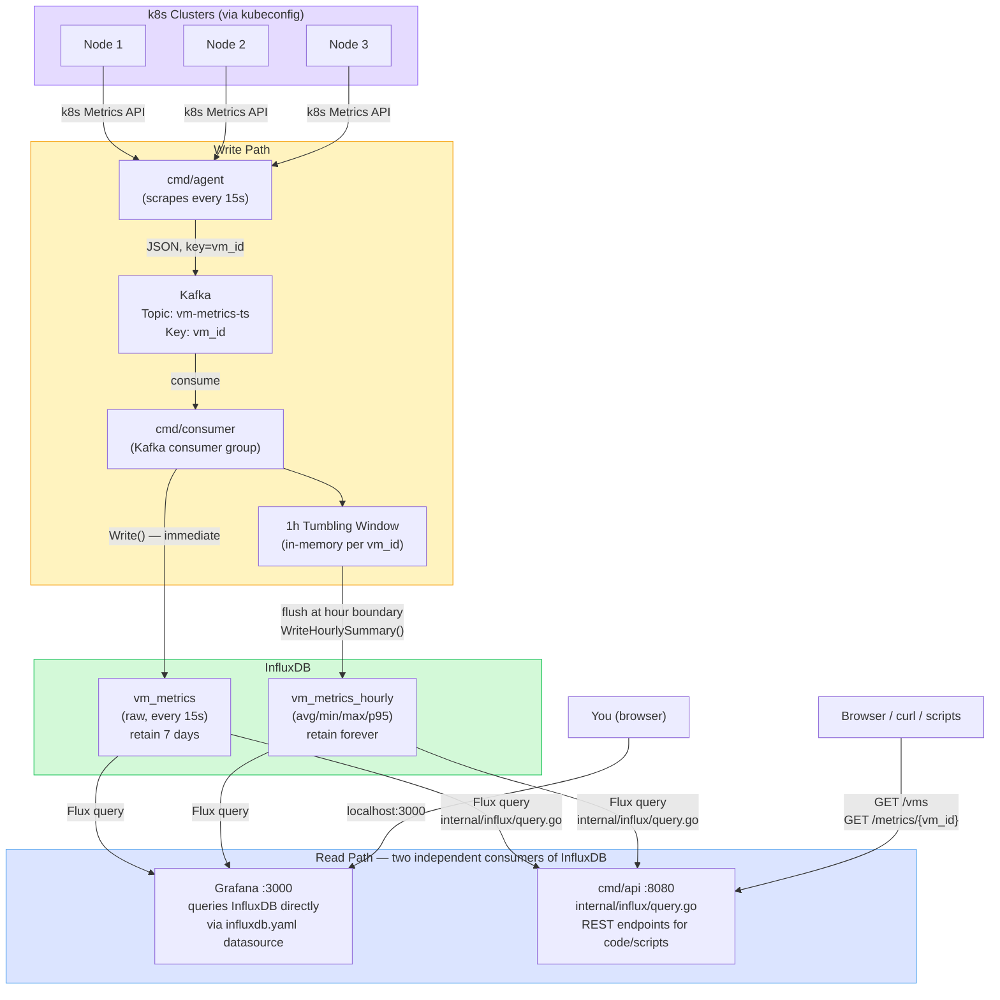

# vm-metrics-collector — Design Document

## Overview

A distributed VM metrics monitoring pipeline built in Go. Addresses three gaps from a system design interview:

- Time-series databases (InfluxDB) vs SQL
- Kafka windowed aggregation (1-hour tumbling windows)
- Push vs pull metrics model

The agent reads node metrics from Kubernetes clusters via kubeconfig and pushes them through Kafka into InfluxDB. A REST API and Grafana dashboard expose the data.

---

## Architecture



### World 1 — docker-compose network layout

```
[MacBook]
  └── docker-compose network
        ├── kafka:9092
        ├── influxdb:8086
        ├── agent  ──────────────────────→  kubeconfig → k8s clusters
        ├── consumer
        ├── api:8080
        └── grafana:3000
```

The **agent is the only container that reaches outside** — it mounts `~/.kube/config` read-only and calls the Kubernetes Metrics API on remote clusters or Rancher Desktop.

---

## Component Breakdown

| Component      | Tech                          | Role                                                              |
|----------------|-------------------------------|-------------------------------------------------------------------|
| Metrics Agent  | Go                            | Reads node metrics via kubeconfig → pushes to Kafka every 15s    |
| Kafka          | confluentinc/cp-kafka (KRaft) | Durable message queue, partitioned by `vm_id`                     |
| Consumer       | Go                            | Reads Kafka → writes InfluxDB, handles 1h tumbling window         |
| InfluxDB       | influxdb:2.7                  | Time-series storage optimized for metrics + timestamps            |
| Query API      | Go (`net/http` + `chi`)       | REST endpoints to query metrics by VM and time range              |
| Grafana        | grafana/grafana:10.4.0        | Dashboard auto-provisioned against InfluxDB                       |

---

## File Structure

```
vm-metrics-collector/
├── docker-compose.yml
├── cmd/
│   ├── agent/
│   │   ├── main.go          ← scrapes k8s metrics API, produces to Kafka
│   │   └── Dockerfile
│   ├── consumer/
│   │   ├── main.go          ← consumes Kafka, writes InfluxDB, windowing
│   │   └── Dockerfile
│   └── api/
│       ├── main.go          ← REST query layer over InfluxDB
│       └── Dockerfile
├── internal/
│   ├── kafka/               ← producer helper + consumer helper
│   │                           used by: cmd/agent (producer), cmd/consumer (consumer)
│   └── influx/              ← InfluxDB write client + query client
│                               used by: cmd/consumer (write), cmd/api (query)
├── grafana/
│   └── provisioning/
│       └── datasources/
│           └── influxdb.yaml   ← auto-wires Grafana → InfluxDB on startup
├── DOCS/
│   └── design.md
├── go.mod
├── go.sum
└── README.md
```

---

## Data Flow & Workflow

### Step-by-step

```
1. Agent starts
   └── Reads KUBE_CONTEXTS env var (e.g. "rancher-desktop")
   └── Every SCRAPE_INTERVAL_SECONDS (default: 15s):
         GET /apis/metrics.k8s.io/v1beta1/nodes
         → extracts cpu_percent, mem_percent per node
         → tags with vm_id, hostname, region, timestamp
         → produces JSON message to Kafka topic vm-metrics-ts
              key = vm_id  ← ensures same VM → same partition

2. Kafka buffers messages
   └── Topic: vm-metrics-ts
   └── Partitions: N (match consumer count)
   └── Retention: 7 days

3. Consumer reads from Kafka
   └── Belongs to consumer group: vm-metrics-consumer-group
   └── Writes raw metric immediately to InfluxDB (real-time queries)
   └── Accumulates into 1-hour tumbling window per vm_id
         On window boundary (each full hour):
           → flush avg/min/max/p95 of cpu/mem/disk to InfluxDB
           → commit Kafka offset

4. InfluxDB stores measurements
   └── Measurement: vm_metrics
   └── Tags: vm_id, hostname, region
   └── Fields: cpu_percent, mem_percent, disk_percent,
               net_in_bytes, net_out_bytes
   └── Timestamp: nanosecond precision

5. Query API serves requests
   └── Reads from InfluxDB via Flux queries
   └── Exposes REST endpoints (see API section)

6. Grafana visualizes
   └── Auto-provisioned datasource pointing to InfluxDB
   └── Dashboards show per-VM time-series and 1h summaries
```

---

## Kafka Topic Design

```
Topic:      vm-metrics-ts
Partitions: N  (match to consumer replica count)
Key:        vm_id   ← all metrics for one VM go to the same partition
Retention:  7 days
```

**Why partition by `vm_id`:** Guarantees ordered delivery per VM, enabling correct in-order tumbling window computation on the consumer side.

---

## 1-Hour Tumbling Window

```
Timeline for vm_id = "node-1":

│── 00:00 ──────────────────── 01:00 ──── boundary ──── 02:00 ──│
│   raw metrics every 15s      │  flush avg/min/max/p95          │
│   accumulated in memory      │  written to InfluxDB            │
│                               │  Kafka offset committed        │
```

- **Window type:** Tumbling (non-overlapping, fixed 1-hour buckets)
- **State:** Kept in-process per partition (no external state store needed at this scale)
- **Late data:** Configurable grace period; late messages update the window before flush

---

## InfluxDB Schema

```
Measurement: vm_metrics
Tags:        vm_id, hostname, region
Fields:      cpu_percent (float), mem_percent (float), disk_percent (float),
             net_in_bytes (int), net_out_bytes (int)
Timestamp:   nanosecond precision
```

**Why InfluxDB over SQL:**

| Concern          | SQL (PostgreSQL)         | Time-Series (InfluxDB)          |
|------------------|--------------------------|---------------------------------|
| Query pattern    | Flexible joins           | Time-range + tag filters        |
| Write throughput | Moderate                 | Very high (append-optimized)    |
| Compression      | Standard                 | High (delta encoding for time)  |
| Retention        | Manual                   | Built-in policies               |
| Best for         | Relational data          | Metrics, events, logs           |

---

## REST API

```
GET /metrics/{vm_id}?start=<unix>&end=<unix>&resolution=1m
    → raw metrics for a VM in a time range

GET /metrics/{vm_id}/summary?window=1h
    → pre-aggregated avg/min/max/p95 for the given window

GET /vms
    → list all known VM IDs seen in InfluxDB

GET /health
    → liveness check
```

---

## Push vs Pull Model

| Aspect       | Push (this project)             | Pull (Prometheus model)          |
|--------------|---------------------------------|----------------------------------|
| Agent        | Pushes to Kafka                 | Exposes `/metrics` endpoint      |
| Collector    | Kafka consumer                  | Prometheus scrapes endpoint      |
| Good for     | Many short-lived VMs            | Stable, long-running services    |
| Backpressure | Kafka handles it                | Scrape interval controls it      |

**Why push here:** VM nodes may come and go; Kafka provides durable buffering so no metrics are lost if the consumer is temporarily down.

---

## Scalability (docker-compose)

| Component  | Stateful? | `--scale` works? | Reason                                      |
|------------|-----------|------------------|---------------------------------------------|
| `agent`    | No        | Yes              | No disk state, no port conflict             |
| `consumer` | No        | Yes              | Kafka consumer group rebalances partitions  |
| `api`      | No        | Yes              | Needs a load balancer (nginx/Traefik)       |
| `kafka`    | Yes       | No               | Brokers need cluster protocol coordination  |
| `influxdb` | Yes       | No               | Data would split across instances           |
| `grafana`  | Yes       | No               | Session state + volume conflicts            |

Scale stateless components with a single flag:

```bash
docker-compose up --scale consumer=3 --scale agent=5
```

Kafka's consumer group protocol auto-rebalances partitions across consumer instances — zero config change needed.

---

## World 1 vs World 2

| Aspect          | World 1 — docker-compose          | World 2 — Kubernetes                          |
|-----------------|-----------------------------------|-----------------------------------------------|
| Start command   | `docker-compose up`               | `kubectl apply -f k8s/`                       |
| Agent auth      | `~/.kube/config` volume mount     | In-cluster ServiceAccount token (automatic)   |
| Agent placement | One agent on dev laptop           | One agent pod per target cluster              |
| VPN requirement | Yes — agent runs on your Mac      | No — agent calls local in-cluster API         |
| Kafka           | Single broker, KRaft mode         | StatefulSet (3 brokers), stable DNS identities|
| Kafka access    | localhost port mapping            | LoadBalancer Service (external IP)            |
| InfluxDB        | Single container                  | StatefulSet + PersistentVolumeClaim           |
| Scalability     | `--scale` for stateless services  | HPA on Deployments                            |
| Use case        | Local dev, smoke test             | Production-like, true multi-cluster demo      |

---

## World 2 — Architecture

### The key insight: one agent per cluster, one central stack

In World 1, one agent on your Mac scrapes all clusters via kubeconfig — requiring VPN
for remote clusters. In World 2, each cluster runs its own agent pod that calls the
**local in-cluster API server** — no VPN, no kubeconfig files, no external auth needed.

All agents push outward to one central Kafka, exposed via a LoadBalancer Service.
The rest of the stack (consumer, InfluxDB, Grafana, API) is deployed once on a
designated "hub" cluster.

```
sql97  → agent pod ──────────────────────────────────┐
sql107 → agent pod (also runs hub stack) ────────────┤──→ Kafka LoadBalancer
sql108 → agent pod ──────────────────────────────────┤       ↓
sql109 → agent pod ──────────────────────────────────┤    consumer
sql120 → agent pod ──────────────────────────────────┘       ↓
                                                          InfluxDB
                                                          API + Grafana
```

**Adding a new cluster = deploy one agent Deployment.** Zero changes to the hub.

### Why LoadBalancer for Kafka (not VPN, not in-cluster-only)

| Option | Problem |
|---|---|
| Kafka inside one cluster only | Other 4 clusters still need to reach it — same problem |
| VPN between clusters | Complex to automate, brittle, not cloud-native |
| LoadBalancer Service | External IP assigned by cloud provider; all agents push to one stable endpoint |

Kafka is the **only** component that needs external exposure. Everything else
(consumer, InfluxDB, Grafana, API) is internal to the hub cluster.

### In-cluster agent auth

World 1 agent reads a kubeconfig file. World 2 agent uses **in-cluster config** —
Kubernetes automatically mounts a ServiceAccount token into every pod:

```go
// World 1 — reads ~/.kube/config
config, err := clientcmd.BuildConfigFromFlags("", kubeconfigPath)

// World 2 — reads ServiceAccount token at /var/run/secrets/kubernetes.io/serviceaccount/
config, err := rest.InClusterConfig()
```

The agent needs a ServiceAccount with permission to read node metrics:

```yaml
apiVersion: rbac.authorization.k8s.io/v1
kind: ClusterRole
metadata:
  name: node-metrics-reader
rules:
  - apiGroups: ["metrics.k8s.io"]
    resources: ["nodes"]
    verbs: ["get", "list"]
```

No kubeconfig file. No `~/.kube/` copying. No VPN.

### Hub cluster — sgn3

sgn3 is both the hub (runs the central stack) and a monitored cluster (runs an agent pod).
No separate machine is needed — one cluster plays both roles.

```
sgn3:
  hub stack:  Kafka + InfluxDB + consumer + API + Grafana
  agent pod:  scrapes sgn3's own nodes → pushes to local Kafka via PLAINTEXT (port 9092)
```

Why sgn3 and not Rancher Desktop?
- Rancher Desktop is on a laptop — not always on, no stable node IP
- sgn3 is always running (IBM Fyre bare-metal, 16CPU/64GB)

### Kafka two-listener design

Kafka must advertise a different address to internal vs external clients:

| Listener | Port | Advertised address | Used by |
|---|---|---|---|
| PLAINTEXT | 9092 | `kafka-0.kafka-headless.monitoring.svc.cluster.local:9092` | consumer pod, hub agent |
| EXTERNAL | 9094 | `<node-ip>:30094` (NodePort) | agent pods on other clusters |

**Critical:** `ADVERTISED_LISTENERS` for EXTERNAL must use the **NodePort (30094)**, not the
pod port (9094). Kafka clients bootstrap via NodePort, then reconnect to the advertised address.
If that address is the pod port (9094), the reconnect fails because nothing listens on 9094 on the node.

**Hub agent exception:** The hub's own agent connects via PLAINTEXT (port 9092) because
pod→nodeIP→NodePort (hairpin NAT) is not supported on bare-metal clusters.

### Deployment

Use `deploy.sh` — do not apply manifests directly. Kafka's `ADVERTISED_LISTENERS` must
contain the real node IP, which `deploy.sh` substitutes at deploy time via `sed`:

```bash
# Deploy hub stack (prompts for confirmation)
./deploy.sh hub ~/Downloads/sgn3/kubeconfig.yaml

# Deploy agents on monitored clusters (prompts for hub cluster)
./deploy.sh agent ~/Downloads/sql97/kubeconfig.yaml \
                  ~/Downloads/sql108/kubeconfig.yaml

# Tear down
./deploy.sh undeploy hub
./deploy.sh undeploy agent ~/Downloads/sql97/kubeconfig.yaml
```

### What each cluster runs

```
sgn3 (hub + monitored):
  k8s/hub/kafka/    — StatefulSet (KRaft) + NodePort Service (30094) + headless Service
  k8s/hub/influxdb/ — StatefulSet + PVC
  k8s/hub/consumer/ — Deployment
  k8s/hub/api/      — Deployment + NodePort Service (30080)
  k8s/hub/grafana/  — Deployment + ConfigMap + NodePort Service (30300)
  k8s/agent/        — agent pod, CLUSTER_NAME=sgn3, connects via PLAINTEXT:9092

sql108, sql120, siqiocp3, ... (monitored only):
  k8s/agent/        — agent pod, CLUSTER_NAME=<cluster>, KAFKA_BROKERS=<node-ip>:30094
```

### NodePort vs LoadBalancer

IBM Fyre bare-metal clusters don't have a cloud load balancer controller.
NodePort is used instead — agents connect directly to the node IP on the assigned port.

| Service | NodePort | Purpose |
|---|---|---|
| kafka-external | 30094 | Kafka EXTERNAL listener for agents on other clusters |
| api | 30080 | REST API for external queries |
| grafana | 30300 | Grafana dashboard |

### File structure

```
k8s/
├── hub/
│   ├── kafka/
│   │   ├── statefulset.yaml   ← REPLACE_KAFKA_LB_IP substituted by deploy.sh
│   │   └── service.yaml       ← NodePort 30094 (external) + headless (internal)
│   ├── influxdb/
│   │   ├── statefulset.yaml
│   │   └── service.yaml       ← ClusterIP only (internal)
│   ├── consumer/
│   │   └── deployment.yaml
│   ├── api/
│   │   └── deployment.yaml    ← includes NodePort Service (30080)
│   └── grafana/
│       ├── deployment.yaml    ← includes NodePort Service (30300)
│       └── configmap.yaml     ← dashboard + datasource provisioning
└── agent/
    ├── serviceaccount.yaml    ← ClusterRole for metrics.k8s.io/nodes
    └── deployment.yaml        ← REPLACE_CLUSTER_NAME + REPLACE_KAFKA_IP substituted by deploy.sh
```

---

## Key Cluster Targets

| Cluster         | Type         | World 1 role                    | World 2 role                               |
|-----------------|--------------|---------------------------------|--------------------------------------------|
| Rancher Desktop | Local k8s    | Dev + smoke test                | Dev only — no stable node IP, not always on |
| sgn3            | IBM Fyre k8s | —                               | Hub + monitored — central stack + agent     |
| sql108          | IBM Fyre k8s | Metrics source (via VPN)        | Monitored only — agent pod                  |
| sql120          | IBM Fyre k8s | Metrics source (via VPN)        | Monitored only — agent pod                  |
| siqiocp3        | IBM Fyre k8s | Metrics source (via VPN)        | Monitored only — agent pod                  |

---

## Tech Stack

| Layer           | Choice                          | Why                                          |
|-----------------|---------------------------------|----------------------------------------------|
| Language        | Go                              | Performance, great for agents and APIs       |
| Message Queue   | Kafka (KRaft, docker-compose)   | Industry standard for metrics pipelines      |
| Time-Series DB  | InfluxDB 2.7                    | Fills interview gap, native time-series      |
| Kafka client    | `confluent-kafka-go` or `sarama`| Go Kafka libraries                           |
| InfluxDB client | `influxdb-client-go`            | Official Go client                           |
| HTTP framework  | `net/http` + `chi` router       | Lightweight                                  |
| Deployment      | `docker-compose` (World 1)      | One-command local demo                       |

---

## Running Locally (World 1)

```bash
# Prerequisites: Rancher Desktop running, ~/.kube/config present

# Start full stack
docker-compose up --build

# Endpoints
# Kafka:      localhost:9092
# InfluxDB:   http://localhost:8086  (admin / adminpassword)
# Query API:  http://localhost:8080
# Grafana:    http://localhost:3000  (admin / admin)

# Tear down
docker-compose down -v
```

---

## Definition of Done (World 1)

- [x] Go agent collects CPU/mem from k8s nodes via kubeconfig
- [x] Agent produces to Kafka with `vm_id` as partition key
- [x] Consumer reads from Kafka and writes raw metrics to InfluxDB
- [x] 1-hour tumbling window aggregation working and flushing to InfluxDB
- [x] REST API: query metrics by VM + time range
- [x] `docker-compose up` brings up full stack (Kafka + InfluxDB + agent + consumer + API + Grafana)
- [x] Grafana dashboard shows per-VM time-series

---

## Definition of Done (World 2)

- [x] Agent uses `rest.InClusterConfig()` instead of kubeconfig file
- [x] Agent Deployment + ServiceAccount + ClusterRole manifests (`k8s/agent/`)
- [x] Kafka StatefulSet (KRaft, single broker) + NodePort Service (`k8s/hub/kafka/`)
- [x] InfluxDB StatefulSet + PVC (`k8s/hub/influxdb/`)
- [x] Consumer Deployment (`k8s/hub/consumer/`)
- [x] API Deployment + NodePort Service (`k8s/hub/api/`)
- [x] Grafana Deployment + ConfigMap for provisioning (`k8s/hub/grafana/`)
- [x] `deploy.sh` CLI handles hub + agent deploy/undeploy with confirmation prompts
- [x] Hub stack deployed on sgn3, agents deployed on multiple clusters
- [x] `curl http://<node-ip>:30080/vms` returns nodes from all clusters
- [x] Grafana dashboard shows metrics from all clusters simultaneously
